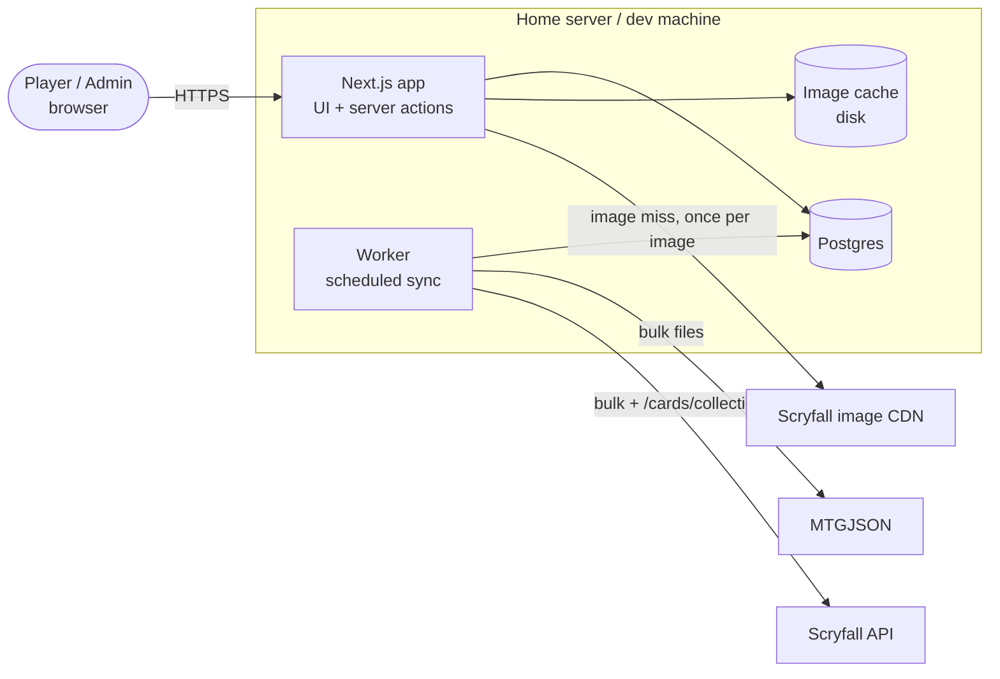
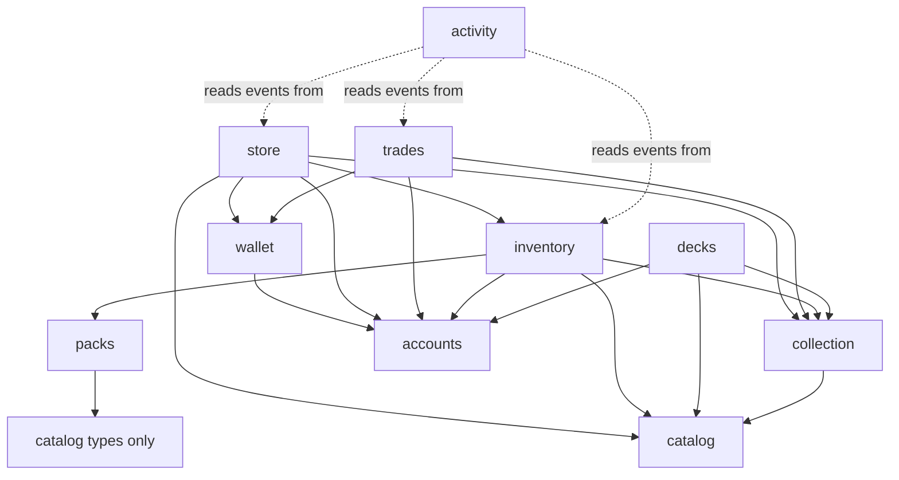
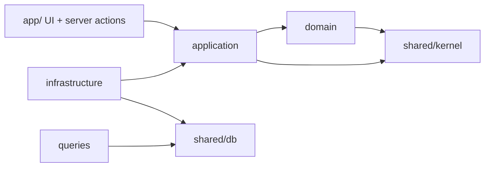
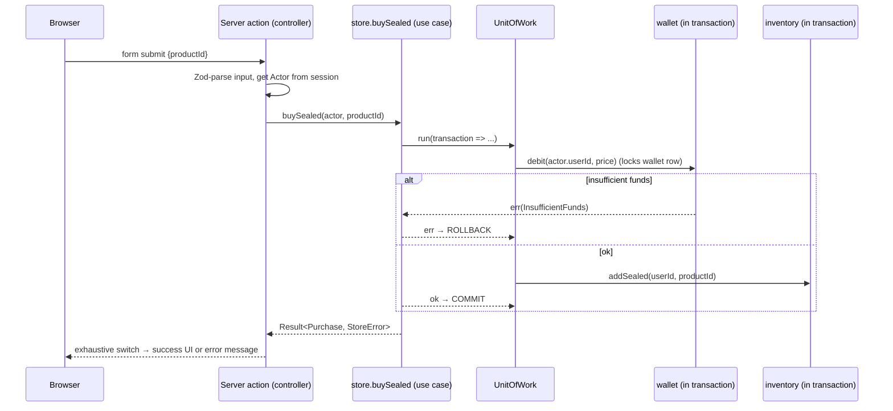

# Architecture overview

> Status: **accepted** (2026-09-26). Decisions are recorded as ADRs in [`../adr/`](../adr/).

## Goals, in priority order

1. **Correctness of money and ownership.** No double spends, no duplicated or lost cards, no
   client-side tampering with pack contents.
2. **Easy to change.** Each feature lives in one place, and swapping a data source or DB adapter
   touches one folder.
3. **Testable without infrastructure.** Core rules (pack odds, allowance, deck legality, trade
   validation) are tested as pure functions in milliseconds.
4. **Legible for a learner.** The structure teaches good design instead of hiding it behind magic.
5. **Not over-engineered.** Every abstraction must pay for itself (see "When _not_ to add an
   abstraction" in [patterns.md](patterns.md#when-not-to-add-an-abstraction)).

## Style in one sentence

A **modular monolith**: one deployable app, split into **feature modules**. Each module is
internally layered as **ports & adapters** around a **functional core**. The pieces are wired
together by **factory functions** in a single **composition root**.

## System context



The app and worker are **two entry points into the same modules**, each with its own composition
root.

## Modules (bounded contexts)

| Module       | Owns                                                                                                                                                             | Kind                              |
| ------------ | ---------------------------------------------------------------------------------------------------------------------------------------------------------------- | --------------------------------- |
| `accounts`   | users, roles, permissions (`canSelfFund`), sessions (via Better Auth), `Actor`                                                                                   | adapter-heavy, thin domain        |
| `wallet`     | append-only ledger, balance, allowance accrual, grants, self-funding, public stats                                                                               | **reference module**, rich domain |
| `catalog`    | sets, **printings** (set, number, finishes, treatments: full art, borderless, showcase…), prices per finish, booster configs, sealed product definitions, images | read-mostly; sync = ACL           |
| `packs`      | pack generation engine: booster config + Rng → cards                                                                                                             | **pure library**, no I/O          |
| `inventory`  | owned sealed product, its lifecycle (unopened → opened), opening                                                                                                 | domain + persistence              |
| `collection` | owned cards at exact **printing × finish** (ADR 0011) + acquisition log                                                                                          | domain + persistence              |
| `store`      | buying sealed and singles, selling back: orchestrates wallet + inventory + collection                                                                            | orchestration only                |
| `decks`      | decks, ownership check, format legality, export formats                                                                                                          | rich domain                       |
| `trades`     | proposals, trade lifecycle, atomic execution                                                                                                                     | rich domain + orchestration       |
| `activity`   | feed of domain events ("X opened a mythic")                                                                                                                      | read model                        |

### Module dependency graph (allowed directions only)



Rules: the graph is **acyclic**. Modules depend on each other **only through their public
`index.ts`**. `catalog` and `accounts` depend on no other feature module.

## Inside a module: layers

```
src/modules/wallet/
  domain/           pure types + pure functions + error types. No I/O, no framework imports.
  application/      use cases (factory functions) + ports (interfaces they need)
  infrastructure/   adapters implementing ports: Drizzle repos, API clients, schema tables
  queries/          read models for the UI (CQRS-lite): SQL in, plain view objects out
  testing/          in-memory fakes of this module's ports, for other tests to reuse
  index.ts          PUBLIC API: the only file other modules / the UI may import
```

The **dependency rule** points inward:



- `domain` imports only `shared/kernel`. Its code can run in a unit test without anything else.
- `application` defines the **ports** it needs (`LedgerRepo`, `Clock`, …) and depends on those
  interfaces, never on Drizzle.
- `infrastructure` implements the ports. It's the only layer that knows about Postgres or HTTP.
- Only the **composition root** (`src/server/container.ts`, `worker/container.ts`) imports
  `infrastructure` and wires it into use cases.

This is enforced by lint (ADR [0009](../adr/0009-lint-enforced-boundaries.md)).

## Cross-cutting pieces (`src/shared/`)

| Path              | Contents                                                                                                                                          |
| ----------------- | ------------------------------------------------------------------------------------------------------------------------------------------------- |
| `shared/kernel/`  | `Result`, `Brand`, `UserId`, `Cents`, `Clock` + `Rng` ports, weighted sampling, `UnitOfWork` port, `assertNever`. Test fakes in `kernel/testing/` |
| `shared/db/`      | Drizzle client factory, `DbExecutor` type, `UnitOfWork` implementation, migration runner                                                          |
| `shared/runtime/` | Real OS-backed adapters for kernel ports: `systemClock`, `randomSeed`                                                                             |
| `shared/config/`  | Zod-parsed environment. The only place that reads `process.env`.                                                                                  |
| `shared/http/`    | (Phase 4) `fetchJson` + composable decorators (`withRateLimit`, `withRetry`, `withUserAgent`)                                                     |

The kernel is deliberately **tiny and stable**. It isn't a `utils/` dumping ground.

## Anatomy of a write request

Example: _buy a Play Booster_.



The controller does **three things only**: parse input, identify the actor, and map the `Result`
to UI. No business rules live in `app/`.

## Anatomy of a read request

Server Component → `collection/queries.getCollectionPage(db, userId, filters)` → one SQL query →
plain serializable view objects → render. Reads skip repositories and use cases on purpose
(ADR [0006](../adr/0006-cqrs-lite-reads.md)).

## Where state and nondeterminism live

| Concern        | Home                                                                            |
| -------------- | ------------------------------------------------------------------------------- |
| Money          | `ledger_entries` (append-only). Balance is always derived.                      |
| Card ownership | `collection` quantities + `acquisitions` log                                    |
| Randomness     | `Rng` port, created server-side per opening. Seeded in tests.                   |
| Time           | `Clock` port. Fixed in tests.                                                   |
| External data  | Only in `catalog/infrastructure` (ACL). Translated to domain types at the edge. |
| Config         | `shared/config/`, passed in by the composition root                             |
| Sessions       | `accounts/infrastructure` (Better Auth) → exposes `getActor()`                  |

## Deployment view

- **Dev (now):** NixOS, flake + direnv, socket-only Postgres in `.dev/`, `pnpm dev`, `pnpm worker`.
- **Prod (Phase 11):** Docker Compose with `app`, `worker` and `db` containers, plus volumes for
  Postgres and images. The code doesn't change because all config comes from env vars.
