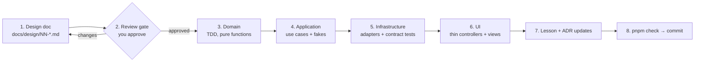

# Roadmap

The source of truth for build order. Each phase produces one lesson (`lessons/NN-*.md`) and ends
with a commit.

## The loop every phase follows

1. **Design:** fill in [`design/TEMPLATE.md`](design/TEMPLATE.md) (types, invariants, use cases,
   ports, state machines, tables, test plan, open questions). New cross-cutting decisions become
   ADRs.
2. **Review gate:** no implementation code until you approve the design doc.
3. **Domain first**, test-driven: pure functions and property tests.
4. **Application:** use-case factories, tested against in-memory fakes.
5. **Infrastructure:** Drizzle repos and gateways, plus contract and integration tests.
6. **UI:** server actions (parse → actor → use case → map Result) and views.
7. **Lesson:** a real lesson that teaches the phase's concepts, **not** a log of what was built.
   It follows the format in [`lessons/README.md`](../lessons/README.md): objectives, concepts built
   up simple → complex with Python comparisons and real repo code, common mistakes, graded
   exercises with verified solutions, a recap, and further reading.
8. **Commit** once `pnpm check` is green.

Inside-out order (domain → UI) means every layer is tested before anything depends on it.

## Phases

| #   | Phase                              | Key patterns introduced                                                                                                     | Status  |
| --- | ---------------------------------- | --------------------------------------------------------------------------------------------------------------------------- | ------- |
| 0   | Dev environment & first TypeScript | —                                                                                                                           | ✅ Done |
| 1   | Architecture foundation            | kernel types, DI, UoW, lint boundaries, test harness                                                                        | ✅ Done |
| 2   | Accounts & roles                   | adapter over Better Auth, `Actor`, policy functions, `proxy.ts`                                                             | ✅ Done |
| 3   | Wallet (**reference module**)      | functional core, repository, ledger, locking, Result, contract tests                                                        | ✅ Done |
| 4   | Catalog & data sync                | ACL, gateways, decorators (rate limit/retry), streams, bulk upsert, image cache, daily price snapshots (ADR 0013)           | —       |
| 5   | Pack engine                        | strategy, composite, weighted sampling, property + statistical tests                                                        | —       |
| 6   | Store & inventory                  | UoW across modules, sealed-item state machine, events                                                                       | —       |
| 7   | Collection & singles store         | CQRS-lite queries, sell singles to the store + store transaction ledger, price-history chart (ADR 0013), URL-driven filters | —       |
| 8   | Opening experience ✨              | client state machine, animation orchestration, asset preload                                                                | —       |
| 9   | Deck builder                       | ownership policy, exporter strategies, proxy print sheet                                                                    | —       |
| 10  | Trades                             | trade state machine, multi-lock ordering                                                                                    | —       |
| 11  | Activity, export & Docker deploy   | outbox-lite feed, exporters, containerization                                                                               | —       |

### Why this order (changed from the original plan)

- **Architecture first:** the kernel (`Result`, brands, `Cents`, `Clock`, `Rng`, `UnitOfWork`),
  test harness and lint boundaries must exist before the first module, or every module
  reinvents them.
- **Wallet before catalog:** wallet uses _every_ core pattern but needs no card data, so it
  becomes the **reference module** that later modules copy. Catalog is mostly
  infrastructure (sync pipelines), which is a better second example once the layering is familiar.
- Accounts come just before wallet because every write needs an `Actor`.

## Phase 1: Architecture foundation (detail)

Design artifacts (this commit): [architecture overview](architecture/overview.md),
[pattern catalog](architecture/patterns.md), [conventions](architecture/conventions.md),
[testing strategy](architecture/testing.md), [ADRs 0001–0011](adr/README.md) (later: 0012 accounts, 0013 price history).

**Review gate:** ✅ ADRs accepted 2026-09-26.

Implementation steps (✅ all done, see [lesson 01](../lessons/01-architecture-foundation.md)):

1. **Shared kernel** (`src/shared/kernel/`): `result.ts`, `brand.ts`, `ids.ts`, `money.ts` (moved
   from `src/lib/money.ts`, now a branded `Cents`), `clock.ts`, `rng.ts` (`seededRng`,
   `weightedPick`, `weightedSample`), `unit-of-work.ts`, `assert-never.ts`. Unit and
   property tested. OS-backed adapters (`systemClock`, `randomSeed`) went to `src/shared/runtime/`.
   `applyRate` is deferred to Phase 3, where the wallet design doc fixes its rounding rule.
2. **Test harness:** Vitest (+ fast-check), `pnpm test`/`test:int`/`check` scripts, and `tcg_test`
   database creation in `scripts/db.sh`.
3. **Config:** `shared/config/` with a Zod-parsed env and a fail-fast startup error message.
4. **DB foundation:** Drizzle client factory, drizzle-kit config, migrations folder, `UnitOfWork`
   (Drizzle implementation + in-memory implementation, with rollback-on-err integration tests).
5. **Composition roots:** `src/server/container.ts` (with the `globalThis` dev cache and
   `server-only`) and `worker/container.ts`, both built on the shared wiring in `src/server/core.ts`.
6. **Lint boundaries:** `eslint-plugin-boundaries`, `import/no-cycle`, and the restricted
   globals/imports from ADR 0009, each proven by a deliberately failing fixture that is then removed.
7. **Walking skeleton:** a `/health` route that goes through container → UoW → DB, proving the wiring.
8. **Lesson 01:** "Designing with types and dependencies". **Commit.**

## Backlog: advanced features, later

Wanted, but deliberately not scheduled yet:

- **Public player profiles:** a page per player showing their history, total spent, and money
  they gave themselves (self-funded). The ledger (ADR 0004) already records everything this needs.

## Phases 2–11

Each starts with its own design doc (`docs/design/NN-<module>.md`) and review gate. Scope per
phase is as described in the original plan's feature list, now organized by module (see the
[module table](architecture/overview.md#modules-bounded-contexts)).
